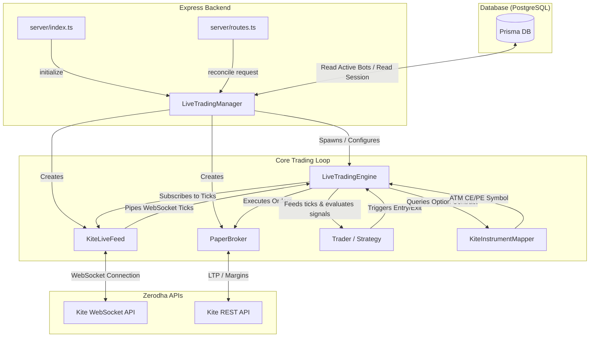
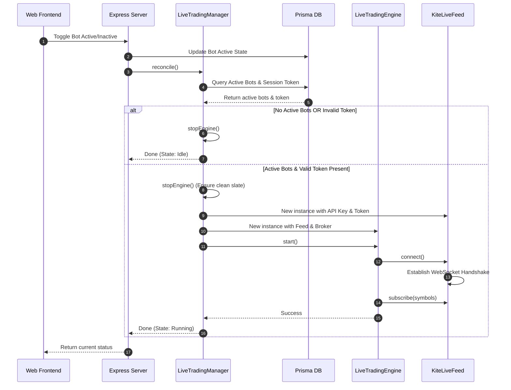
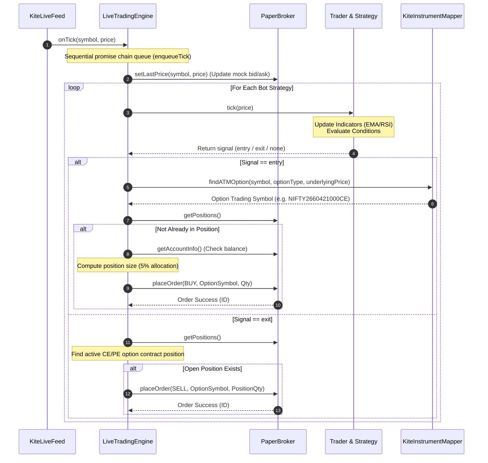

# Live-Trading Architecture Flow

This document details the current runtime architecture of the `quantomate` live trading system, detailing how components interact from startup through live tick processing to execution.

---

## 1. Component Relationship

The following architecture diagram represents the relationship between the Express Server, the Database, the `LiveTradingManager` orchestrator, and the core components of the trading loop:

---

## 2. Startup & Reconciliation Sequence

When the server starts or the user triggers a toggle on the UI dashboard, the system reconciles the active trading engines:

---

## 3. Live Tick Processing & Order Execution Loop

Once running, ticks stream asynchronously from the websocket feed. The engine enqueues them sequentially to maintain strict state consistency:

---

## 4. Key Areas to Target for Refactoring

During our review, we should keep the following aspects of the current system in mind:

1. **State Preservation (Hot Reloading)**:
   - *Current issue*: When the server restarts (e.g. via nodemon), `LiveTradingEngine` is recreated. This resets all `Dataset` history (EMA and RSI values are lost until enough ticks arrive to recompute them).
   - *Improvement*: Persist recent indicator values or historical ticks in the DB/Redis to hot-start datasets on initialization.
2. **WebSocket Threading / Worker Process**:
   - *Current issue*: The websocket runs inside the main Express single thread. A CPU-heavy operation on the server can delay tick consumption.
   - *Improvement*: Spawn the `LiveTradingEngine` in a separate Node `Worker Thread` or process, communicating state back to the main thread via IPC.
3. **Paper Order Matching Accuracy**:
   - *Current issue*: `PaperBroker` simulates market orders by matching them at the last traded price of the underlying or the option contract.
   - *Improvement*: Introduce slippage models or bid/ask spread margins to backtests and paper execution to match live trading environments.
