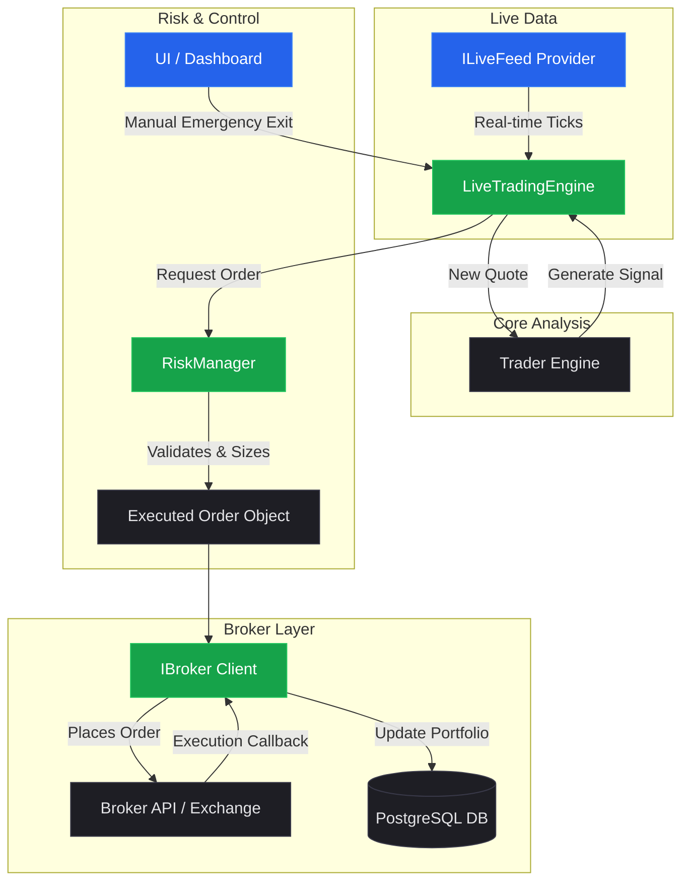

# Paper and Live Trading System Design

This document outlines the architecture, requirements, and design for extending **Quantomate** to support paper and live trading. Since actual capital is involved, the architecture must be designed with **resilience, safety, clear boundaries, and plug-and-play interfaces** in mind.

---

## 1. Current Architecture vs. Required Components

Before building, we review what is currently implemented in `packages/core`, `packages/data`, and `packages/db`, and highlight the missing gaps.

### 1.1 Existing Architecture Components
- **`Dataset` & `Quote` (`packages/core`)**: Optimized columnar storage structures for handling historical price series, adding new ticks, and calculating indicators/strategies.
- **`Strategy` (`packages/core`)**: Base class defining direction (long/short), trigger conditions (entry/exit/stop-loss/take-profit), and rule applications.
- **`Trader` (`packages/core`)**: A lightweight wrapper around `Dataset` and `Strategy` that receives sequential ticks via `.tick(quote)` and returns signals.
- **`Backtest` (`packages/core`)**: A simulator that runs a strategy over a historical dataset and measures returns, entry/exit points, and slippage.
- **`DataService` & `YahooFinanceProvider` (`packages/data`)**: Caching layer using Prisma PostgreSQL and static quote polling/historical data retrieval.
- **Database Schema (`packages/db`)**: Standard tables for `Symbol`, `HistoricalPrice`, `StrategySignal`, and `FundamentalMetric`.

### 1.2 Missing Components for Paper & Live Trading
1. **Live Data Feed (`ILiveFeed`)**: Current data providers are poll-based. We need web-socket/streaming support to receive real-time, low-latency quote events.
2. **Broker Abstraction Layer (`IBroker`)**: No concept of account balances, open positions, order execution, or broker clients.
3. **Execution Engine / Live Coordinator (`LiveTradingEngine`)**: A background manager that listens to live data feeds, passes them to strategy handlers, and submits orders to the broker.
4. **Risk Manager / Position Sizer (`RiskManager`)**: Capital limits, drawdown check, position sizing (Kelly Criterion, fixed-risk, volatility-adjusted ATR-sizing), and portfolio concentration constraints.
5. **Paper Trading Engine (`PaperBroker`)**: A simulated broker that uses live market quotes to fill mock orders locally using simulated account capital, transaction costs, and slippage models.
6. **Execution Database Models**: New schema tables to track `Account`, `Order` history, `Position` states, and execution logs.
7. **UI Dashboard & Manual Controls**: Web dashboard (linked with `quantomate-portfolio` or a unified frontend) to view live charts, open positions, P/L, toggle automated bots, and manual "panic" exit controls.

---

## 2. Proposed Architecture

The trading system must isolate concerns so that strategy logic, data streaming, and broker execution do not interfere with each other. This is crucial for day trading and options execution.



---

## 3. Options & Day Trading Requirements

Options trading introduces complexities that standard stock trading systems do not have:
* **Contract Specification**: Symbols are not simple tickers (e.g. `AAPL`). They are option contract codes representing underlyings, expiry dates, strike prices, and types (Calls/Puts).
* **Option Chain Fetching**: The data provider must be able to fetch the Option Chain for a given underlying.
* **Greeks Calculation**: Access to Delta, Gamma, Theta, Vega, and Implied Volatility is essential for options pricing and risk models.
* **Multi-Leg Orders**: Spreads, Straddles, Iron Condors require submitting multiple legs simultaneously (often handled as a single composite order at the broker).
* **Time Sensitivity**: Day trading requires low-latency tick processing. Ticks must be queued sequentially using a producer-consumer model to prevent concurrent race conditions.

---

## 4. Interface Specifications

### 4.1 Broker Abstraction (`IBroker`)
Brokers are attached as modular drivers. The engine itself should not know or care which broker is execution-active.

```typescript
export interface BrokerAccount {
  accountId: string;
  cashBalance: number;
  portfolioValue: number;
  marginBuyingPower: number;
  currency: string;
  isPaper: boolean;
}

export type OrderSide = 'buy' | 'sell' | 'buy_to_open' | 'sell_to_close' | 'buy_to_close' | 'sell_to_open';
export type OrderType = 'market' | 'limit' | 'stop' | 'stop_limit';
export type OrderStatus = 'pending' | 'submitted' | 'filled' | 'canceled' | 'rejected';

export interface OrderRequest {
  symbol: string;             // Stock ticker or Option contract ID
  qty: number;
  side: OrderSide;
  type: OrderType;
  limitPrice?: number;
  stopPrice?: number;
  timeInForce?: 'day' | 'gtc' | 'ioc';
  parentOrderId?: string;     // For bracket orders (take-profit/stop-loss legs)
}

export interface OrderResult {
  id: string;
  clientOrderId: string;
  status: OrderStatus;
  filledQty: number;
  avgFillPrice?: number;
  filledAt?: Date;
  commissionPaid?: number;
}

export interface BrokerPosition {
  symbol: string;
  qty: number;
  avgEntryPrice: number;
  marketPrice: number;
  unrealizedPL: number;
  costBasis: number;
}

export interface IBroker {
  getAccountInfo(): Promise<BrokerAccount>;
  getPositions(): Promise<BrokerPosition[]>;
  placeOrder(order: OrderRequest): Promise<OrderResult>;
  cancelOrder(orderId: string): Promise<boolean>;
  getOrders(status?: OrderStatus): Promise<OrderResult[]>;
}
```

### 4.2 Live Feed (`ILiveFeed`)
Data sources stream quotes through an event emitter interface.

```typescript
export type TickCallback = (quote: {
  symbol: string;
  price: number;
  bid?: number;
  ask?: number;
  volume: number;
  timestamp: number;
}) => void;

export interface ILiveFeed {
  connect(): Promise<void>;
  disconnect(): Promise<void>;
  subscribe(symbols: string[], callback: TickCallback): void;
  unsubscribe(symbols: string[]): void;
  onDisconnect(callback: () => void): void;
}
```

### 4.3 Position Sizer & Risk Management (`RiskManager`)
Ensures that we do not violate risk tolerances. This is run immediately before order routing.

```typescript
export interface RiskLimits {
  maxPositionSizePercent: number;  // Max capital allocated to single position (e.g. 10%)
  maxDailyLoss: number;            // Daily dollar drawdown circuit-breaker (e.g. $500)
  maxLeverage: number;             // Maximum leverage factor (e.g. 1.0 = cash only)
  stopLossDefaultPercent?: number; // Standard stop loss if strategy doesn't supply one
}

export class RiskManager {
  constructor(private limits: RiskLimits) {}

  /**
   * Evaluates if an order can be executed and computes the appropriate quantity.
   */
  async validateAndSizeOrder(
    request: OrderRequest,
    account: BrokerAccount,
    currentPrice: number,
    stopPrice?: number
  ): Promise<{ approved: boolean; qty: number; reason?: string }> {
    // 1. Check daily loss circuit-breaker
    if (await this.isDailyLossExceeded()) {
      return { approved: false, qty: 0, reason: 'Daily loss limit exceeded' };
    }

    // 2. Kelly Criterion or Fixed Risk calculations
    let calculatedQty = request.qty;
    if (stopPrice && stopPrice > 0) {
      const riskPerShare = Math.abs(currentPrice - stopPrice);
      const riskCapital = account.portfolioValue * 0.01; // Risk 1% of equity per trade
      calculatedQty = Math.floor(riskCapital / riskPerShare);
    }

    // 3. Max position size rule
    const targetValue = calculatedQty * currentPrice;
    const maxValAllowed = account.portfolioValue * this.limits.maxPositionSizePercent;
    if (targetValue > maxValAllowed) {
      calculatedQty = Math.floor(maxValAllowed / currentPrice);
    }

    // 4. Buying power check
    if (calculatedQty * currentPrice > account.marginBuyingPower) {
      calculatedQty = Math.floor(account.marginBuyingPower / currentPrice);
    }

    if (calculatedQty <= 0) {
      return { approved: false, qty: 0, reason: 'Insufficient capital or risk bounds restricted size to 0' };
    }

    return { approved: true, qty: calculatedQty };
  }

  private async isDailyLossExceeded(): Promise<boolean> {
    // Query executions from DB today, sum realized P&L
    return false; // Stub
  }
}
```

---

## 5. UI Integration & Manual Overrides

To maintain absolute manual control over the automated trading system, the UI (built inside `quantomate-portfolio`) will host a **Trading Control Panel**.

### 5.1 Manual Overrides Panel
* **Panic Exit**: An emergency button that sends a `cancel_all_orders` and `market_exit_all_positions` instruction to the active `IBroker` instance.
* **Individual Position Exit**: A button next to each active position row in the UI that issues a market/limit exit order for that specific ticker.
* **Kill Switch / Toggle**: A master switch to pause strategy ticks for a bot. When off, the engine stops subscribing to quotes for that strategy and ignores signal triggers.

### 5.2 Schema Additions (Prisma PostgreSQL)
```prisma
model TradingAccount {
  id              String           @id
  provider        String           // "alpaca", "interactive_brokers", "paper"
  name            String
  isLive          Boolean          @default(false)
  balance         Float
  currency        String           @default("USD")
  orders          TradingOrder[]
  positions       TradingPosition[]
  createdAt       DateTime         @default(now())
}

model TradingOrder {
  id              String           @id @default(uuid())
  accountId       String
  symbol          String
  qty             Float
  side            String           // "BUY", "SELL", etc.
  type            String           // "LIMIT", "MARKET"
  price           Float?
  status          String           // "PENDING", "FILLED", "CANCELED"
  filledPrice     Float?
  commission      Float            @default(0)
  createdAt       DateTime         @default(now())
  updatedAt       DateTime         @updatedAt
  account         TradingAccount   @relation(fields: [accountId], references: [id])
}

model TradingPosition {
  id              String           @id @default(uuid())
  accountId       String
  symbol          String
  qty             Float
  entryPrice      Float
  marketPrice     Float
  updatedAt       DateTime         @updatedAt
  account         TradingAccount   @relation(fields: [accountId], references: [id])
}
```

## 6. Development & Safety Roadmap (Indian Stock Market & Zerodha Kite Connect First)

Because real money is on the line, we propose a strict 4-phase rollout plan focusing on Zerodha Kite Connect (Indian stock market) first for paper trading validation.

### Phase 1: Zerodha/Kite Connect Authenticator & WebSocket Client (Simulation Mode)
* **Authentication Handler**: Setup the login callback flow to handle the Zerodha `request_token` and retrieve the `access_token` session.
* **WebSocket Ticker**: Implement a `KiteLiveFeed` class using the official `kiteconnect` JavaScript/TypeScript library client. Establish WebSocket connections to stream tick data for selected instrument tokens.
* **Paper Broker (`PaperBroker`)**: Build the generic `IBroker` simulator (tracking virtual INR cash, taxes/STT, NSE/BSE transaction charges, and mock limit/market fills).
* **Live Engine Core (`LiveTradingEngine`)**: A background service processing WebSocket ticks sequentially to generate triggers via the `Trader` engine and dispatch transactions to the `PaperBroker`.

### Phase 2: Risk Management & UI Control Panel
* **Zerodha Risk Rules**: Account for Indian market constraints (e.g., MIS vs. CNC product types, leverage limits, market hours 09:15 to 15:30 IST).
* **Portfolio Server Integration**: Connect the server in `quantomate-portfolio` to coordinate the engine's active connections.
* **UI Controls**: 
  * Toggles to enable/disable specific strategy bots.
  * Real-time position tracking grid (INR P/L) with a manual **Panic Sell / Close Position** option.
  * Auth token state status indicator in UI (since Zerodha tokens expire daily and require daily manual login).

### Phase 3: Indian Stock/Options Testing on Paper API
* **Instrument Token Mapping**: Establish a helper to map standard NSE/NFO ticker names (e.g., `RELIANCE`, `NIFTY26JUN24500CE`) to Zerodha's internal `instrument_token` IDs.
* **Local Paper Run (2-Week Test)**: Run strategies (e.g. Golden Cross, RSI) in paper trading mode using the live `KiteLiveFeed` WebSocket. Ensure:
  * Connection is resilient (reconnects on drop).
  * Tick queues do not create CPU bottlenecking.
  * High-frequency ticks are processed in correct sequence.
  * Order logs and simulated fills match actual market spreads.

### Phase 4: Small Capital Live Execution & US Markets Extension
* **Transition to Live (`KiteBroker`)**: Deploy the live `KiteBroker` wrapper class submitting actual orders to Zerodha Kite. Begin with single shares of liquid NSE stocks (e.g., `ITC`, `TATASTEEL`).
* **Tradier Broker integration**: Once approved, implement the `TradierBroker` under the same `IBroker` interface, allowing plug-and-play switching to US stock/options markets.
* **Continuous Monitoring**: Track transaction slips, broker API rate limits, daily token authorization health, and adjust risk models.

