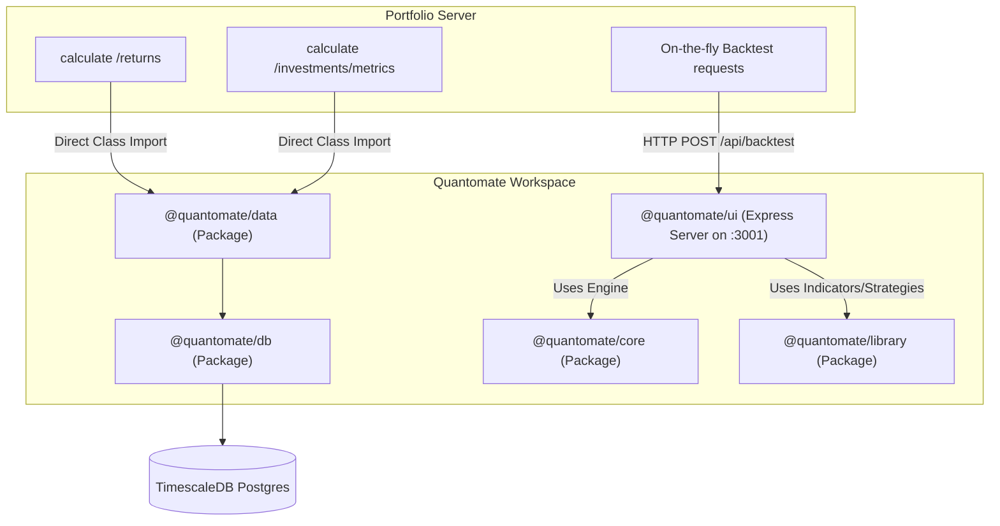

# Quantomate Refactoring & Restructuring Roadmap

This document outlines the architectural roadmap for restructuring the `quantomate` repository into a highly scalable, Single Responsibility Principle (SRP) compliant, and modular quantitative trading codebase. It serves as a guide for developer alignment, outlining technical decisions, service boundaries, and future integration patterns.

---

## 1. Architectural Vision & Core Restructuring

We will partition the workspace into **five separate packages** inside the monorepo. This provides clean responsibility boundaries and allows external projects to consume specific parts of the codebase without pulling in unnecessary database or server frameworks.

```
quantomate/
├── docs/                      # Documentation and architecture diagrams
├── packages/
│   ├── db/                    # TimescaleDB Prisma models & client config
│   ├── core/                  # Core trading engine (Dataset, Strategy, Indicator, Backtest)
│   ├── library/               # Pure math indicators (RSI, EMA, etc.) and strategy definitions
│   ├── data/                  # Market data ingestion (Yahoo Finance), caching, and DB sync
│   ├── ui/                    # Dashboard web application (React client + Express backend)
│   └── playground/            # Gitignored developer scripts & scratchpad
```

### 1.1 Package Definitions & Service Boundaries

#### `@quantomate/db` (Database Configuration)
*   **Role:** Direct interface with the PostgreSQL/TimescaleDB database. Holds the Prisma schema and exports the `prisma` client wrapper.

#### `@quantomate/core` (Pure engine base)
*   **Role:** In-memory dataset management and backtest running base. Exposes core classes: `Dataset`, `Quote`, `Indicator`, `Strategy`, `TradePosition`, `Backtest`, `Trader`.
*   **Decoupling:** Has **zero database dependencies** and **zero networking dependencies**. It performs pure synchronous calculations in memory.

#### `@quantomate/library` (Indicators & Strategies)
*   **Role:** Extensible libraries for mathematical technical indicators (RSI, EMA, SMA, ATR, Bollinger Bands, MACD, PivotTrend) and strategy rules (Golden Cross, RSI Mean Reversion, PivotTrend, BollingerBands, StrongPullback).
*   **Decoupling:** Depends only on `@quantomate/core`. Contains **no database dependencies**. Can be imported by any frontend or server project to compute technical indicators from simple raw data streams.

#### `@quantomate/data` (Ingestion, Sync, and Caching)
*   **Role:** Market data provider integration, syncing logic, cache enforcement, and fundamental analysis scoring.
*   **Architecture:**
    *   **Modular Ingestion:** Built around an abstract `IDataProvider` interface. The primary driver is `YahooFinanceProvider` (wrapping `yahoo-finance2`), but it supports hot-swapping other providers.
    *   **Cache TTL Rules:** 
        *   *Historical Data:* Daily candlestick history is cached permanently for past days. Cache sync checks are limited by a 12-hour TTL.
        *   *Fundamentals:* Sync occurs weekly or quarterly; cached in `fundamental_metrics` with a 7-day Cache TTL.
*   **Decoupling:** Depends on `@quantomate/db` and `@quantomate/core`. Exposes internal services (`DataService`, `FundamentalService`) and a REST server endpoint for third-party HTTP clients.

#### `@quantomate/ui` (Visualizer Application)
*   **Role:** Express backend route runner and React frontend dashboard. Runs backtests, executes charts rendering, and tracks active portfolio scanning signals.

---

## 2. Integration Architecture: Quantomate & Portfolio

The portfolio project (`quantomate-portfolio`) requires investment data, returns calculations, and technical signals. We establish a **hybrid integration boundary** based on performance and coupling tradeoffs.

### 2.1 Hybrid Integration Flow



### 2.2 In-Process vs. Over-the-Network Tradeoffs

| Operation | Chosen Integration | Rationale / Tradeoffs |
| :--- | :--- | :--- |
| **Data Queries & Signals** (`/returns`, `/metrics`) | **In-Process Import** (Import `@quantomate/data`) | * Tradeoff: **Tight Coupling vs. High Performance**<br>* *Pros:* Direct database access bypasses the HTTP serialization layer (JSON stringify/parse of large price arrays). TypeScript typing is verified at compile time.<br>* *Cons:* Both services must share database connection strings and pooling parameters (pooling should be configured carefully to prevent exceeding maximum PostgreSQL connections). |
| **On-the-fly Tasks** (Backtesting Strategy runs) | **Over-the-Network** (HTTP REST requests) | * Tradeoff: **Loose Coupling vs. Network Overhead**<br>* *Pros:* Strategy loading and heavy CPU-bound backtest calculations are offloaded to the Quantomate service, keeping the Portfolio web server responsive.<br>* *Cons:* Small HTTP transmission delay, but negligible for backtest execution times. |

---

## 3. Monorepo Package Imports for Outside Projects

### 3.1 Importing Specific Packages Separately
Yes! Because of the NPM/Yarn workspaces monorepo architecture, **each directory under `packages/` is compiled and packaged as an independent NPM module**.

An external project (like `quantomate-portfolio`) can import *only* a specific package (such as `@quantomate/library` or `@quantomate/core`) without pulling in database libraries, Prisma, or Express.

#### Development Configuration (Local Relative Path)
In the external project's `package.json`:
```json
{
  "dependencies": {
    "@quantomate/core": "file:../quantomate/packages/core",
    "@quantomate/library": "file:../quantomate/packages/library"
  }
}
```

#### Production Configuration (Published Package Registry)
If packages are published to a private registry (e.g. GitHub Packages or private npm):
```json
{
  "dependencies": {
    "@quantomate/core": "^1.0.0",
    "@quantomate/library": "^1.0.0"
  }
}
```

This ensures complete architectural independence. An outside project can do:
```typescript
import { Dataset } from '@quantomate/core';
import { RSI } from '@quantomate/library';

const dataset = new Dataset([10, 11, 12, 11, 10, 9, 8, 9, 10]);
dataset.apply(new RSI('rsi_14', 14));
```
Without needing to set up PostgreSQL connection keys or install any DB drivers.

---

## 4. Refactoring Roadmap & Checklists

### Phase 1: Separate Core & Math Library
- [ ] Create new package `packages/library`:
  - Initialize `package.json` naming it `@quantomate/library`.
  - Move indicator definitions (`packages/indicators/src/*`) into `packages/library/src/indicators`.
  - Move strategy definitions (`packages/strategies/src/*`) into `packages/library/src/strategies`.
- [ ] Keep `packages/core` clean:
  - Houses only `Dataset`, `Quote`, `Indicator`, `Strategy`, `TradePosition`, `Backtest`, `Trader`.
  - Remove all math indicators/strategies from core.
- [ ] Update build scripts and typescript configurations in `@quantomate/core` and `@quantomate/library`.

### Phase 2: Ingestion & Cache Sync (`packages/data`)
- [ ] Create `IDataProvider` interface and implement `YahooFinanceProvider` (using `yahoo-finance2`).
- [ ] Consolidate cache and synchronization logic (daily prices, 7-day fundamental metrics cache) inside `packages/data/src/DataService.ts`.
- [ ] Support direct client methods (for inside import) and a REST server in `packages/data/src/server.ts` (running on port `3002`).

### Phase 3: External Integration Update
- [ ] Update `quantomate-portfolio` `package.json` to depend directly on local paths of `@quantomate/data` and `@quantomate/library`.
- [ ] Refactor `/returns` and `/analysis` route handlers in `quantomate-portfolio` to call `DataService` classes in-process rather than proxying HTTP queries, keeping the REST endpoint fallback for on-the-fly backtests.
- [ ] Update `@quantomate/ui` backtest endpoints to use `@quantomate/core` and `@quantomate/library`.
